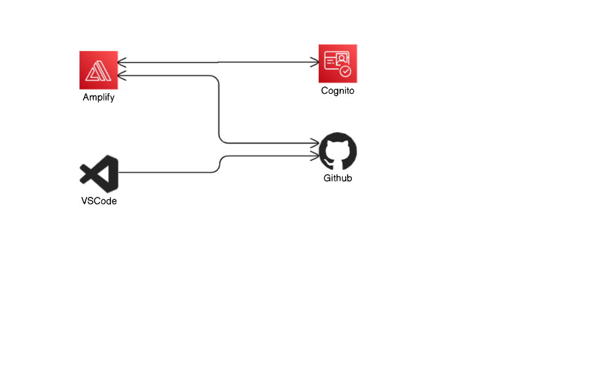
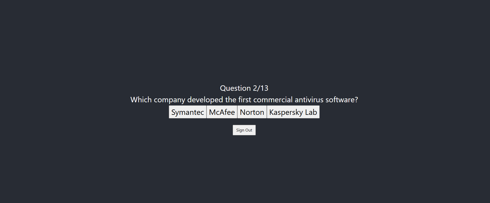

this is a web application that has been built using react , AWS Amplify, AWS Cognito and with ensuring of CI/CD integrity.

## Further details and steps:
1. Ensure that you have node js installed in your machine
2. Create a project using npm. 
3. Install aws-amplify cli, and configure it to use a user account in AWS.
4. Configure the backend ( Cognito) and push the changes to AWS.
5. Change the code with the code of the quiz app and start the app.
### CONTINUE: To run the code from AWS Amplify and enable CI/CD integration
6. Create a repo and push the code to Github or any other platform.
7. Create a frontend in AWS Amplify and integrate it with the repo.

## Deployment Architecture
  

## App in Action
  
 
## Reference:

- This commands and code files that were used is from this repo [amplify-cognito-quiz](https://github.com/tinytechnicaltutorials/amplify-cognito-quiz) and by following the steps in this [Youtube video tutorial] (https://www.youtube.com/watch?v=ma1FA2be8Ac)

